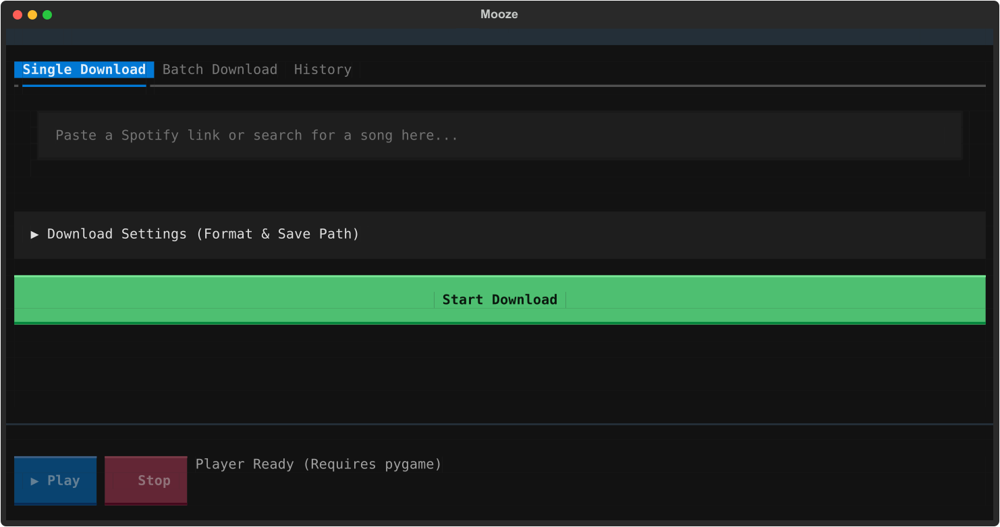

# 🎵 Mooze

<!-- PROJECT BADGES -->

<div align="left">
  
  
  
  
  
</div>

---


<p align="center">
  
</p>

---

## ✨ Features

* **Tabbed Workspace Navigation:** Seamless switching between dedicated single-track queries, high-volume batch input feeds, and persistent download history.
* **Smart Spotify Playlist & Album Scraper:** Paste a single Spotify Playlist or Album link and Mooze will automatically expand and queue every track in the list.
* **Live Queue Sidebar:** Real-time visual tracking of batch progress with dynamic status indicators (⏳ Pending, ▶ Downloading, ✅ Finished, ❌ Failed).
* **Built-in Terminal Audio Player:** Preview finished downloads directly inside the terminal dashboard powered by `pygame`.
* **Persistent Download History:** Automatically logs past downloads to a local history ledger accessible from the UI.
* **Silent Auto-Updater:** Automatically checks PyPI on startup to notify you when a new release of `mooze` is ready.
* **Power-User Syntax Parser:** Replaces rigid dropdown selections with a strict text-based format specification engine, parsing raw target extensions and custom bitrates on the fly.
* **Collapsible Environment Control:** A clean, expandable contextual parameter drawer housing environment variables like destination paths and custom format syntax.

---

## 🛠️ Prerequisites

Mooze handles processing down to raw audio streams via `yt-dlp`. An installation of **FFmpeg** must be globally discoverable in your system environment variable path.

### Package Manager Directives


| Operating System     | Command                   |
| :--------------------- | :-------------------------- |
| **Windows** (WinGet) | `winget install ffmpeg`   |
| **macOS** (Homebrew) | `brew install ffmpeg`     |
| **Linux** (APT)      | `sudo apt install ffmpeg` |

---

## 🚀 Installation

Install Mooze directly from PyPI or editable local development mode:

### 1. Direct Installation via PyPI

```Shell
pip install mooze
pip install pygame
```

### 2. From Source Tree

```Shell
git clone [https://github.com/X0fx/mooze.git](https://github.com/X0fx/mooze.git)
cd mooze
pip install -e .
pip install pygame
```

---

## 📖 User Manual

Once installed, simply type `mooze` in any terminal to launch the dashboard.

### 🎛️ Audio Format Syntax Matrix

Open **Download Settings** and define your target format using the syntax input (`.[ext], [bitrate]`). Bitrates are bounded between **92 kbps** and  **320 kbps** .


| **Syntax Input** | **Extracted Codec** | **Output Fidelity**     | **Metadata Embedding**     |
| ------------------ | --------------------- | ------------------------- | ---------------------------- |
| `.mp3, 320`      | MP3                 | High-Bitrate Master     | Enabled (Cover Art + Tags) |
| `.mp3, 128`      | MP3                 | Standard Compressed     | Enabled (Cover Art + Tags) |
| `.m4a, 192`      | M4A                 | AAC Container Stream    | Enabled (Cover Art + Tags) |
| `.flac, 256`     | FLAC                | Compressed Lossless     | Metadata Tags Only         |
| `.wav, 192`      | WAV                 | PCM Uncompressed Linear | Metadata Tags Only         |
| `.opus, 160`     | OPUS                | Low-latency Interactive | Metadata Tags Only         |

### 📥 Execution Modes

1. Single Track / Playlist Query

   * Select the **Single Download** tab.
   * Paste a track name, raw Spotify track link, or a  **Spotify Playlist / Album link** .
   * Click  **Start Download** . The Live Queue sidebar will expand automatically if processing multiple songs!
2. Batch Links

   * Select the **Batch Download** tab.
   * Paste multiple Spotify links (one per line).
   * Click  **Start Download** . Multi-song batches are automatically zipped into `Mooze_Batch_Archive.zip`.
3. Live Preview & Audio Player

   * Once a track completes, the **▶ Play** button on the bottom Audio Bar will unlock.
   * Click **▶ Play** to preview your downloaded song instantly. Click **⏹ Stop** to halt audio.
   * Visit the **History** tab to review previous downloads.

---

## ⚠️ Disclaimer

This tool is for educational purposes and personal use only. It relies on publicly available APIs and YouTube search mechanisms. Please respect digital rights and support the artists you listen to.
